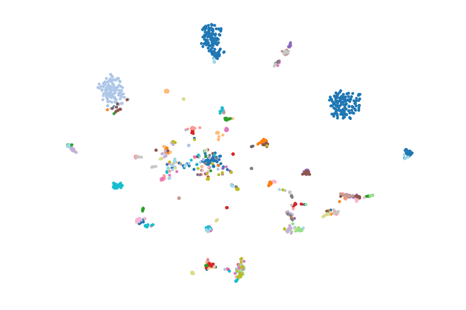
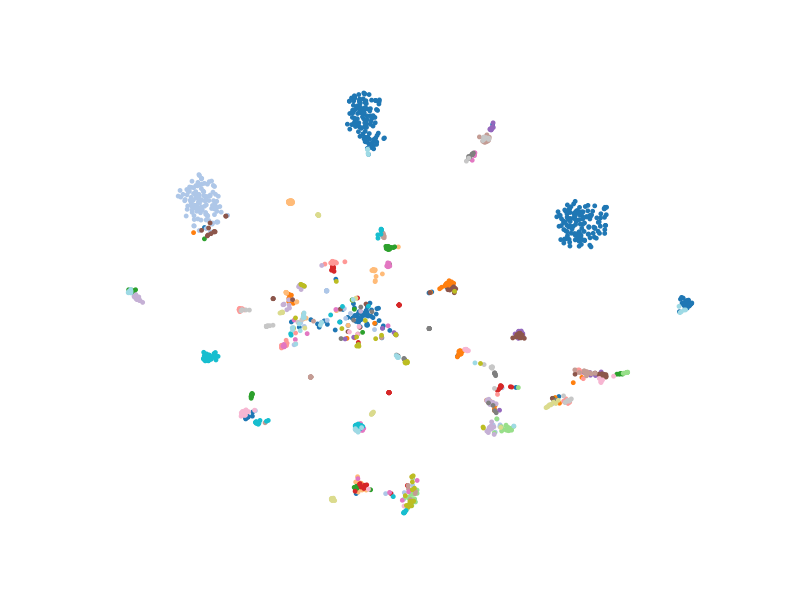
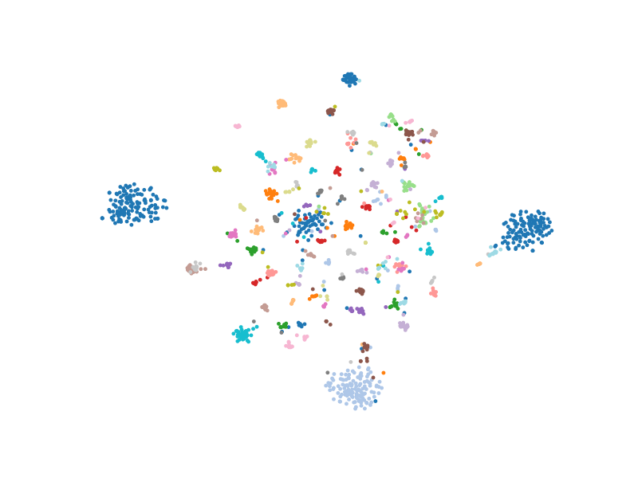
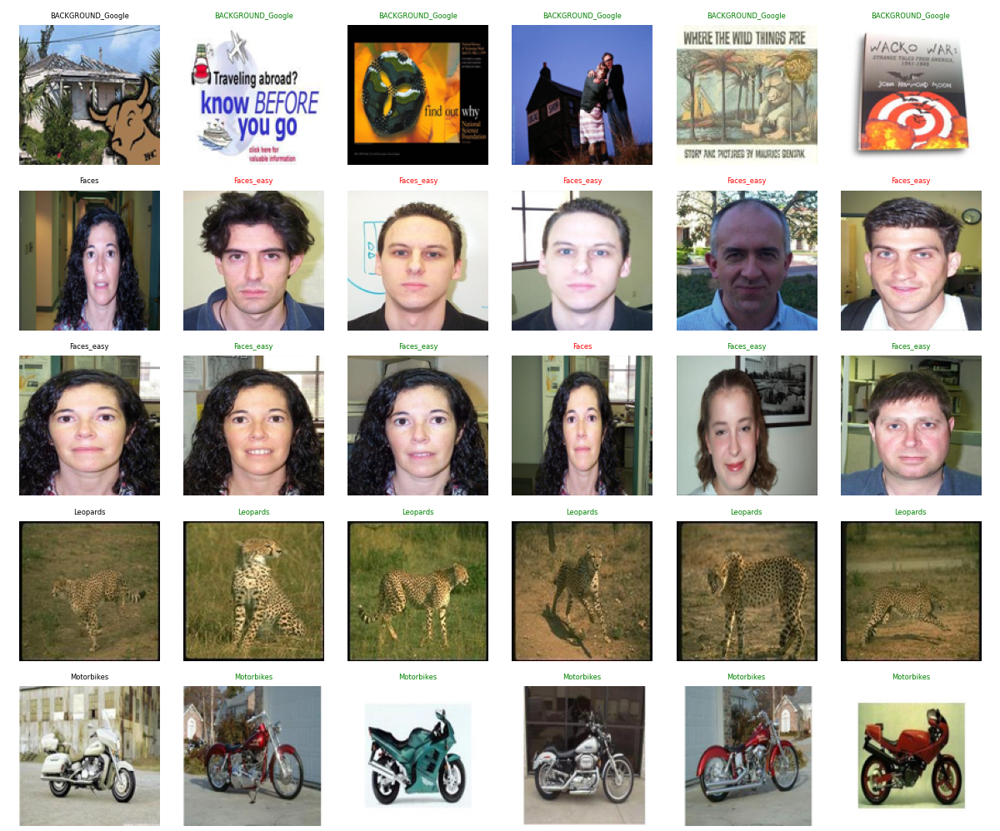
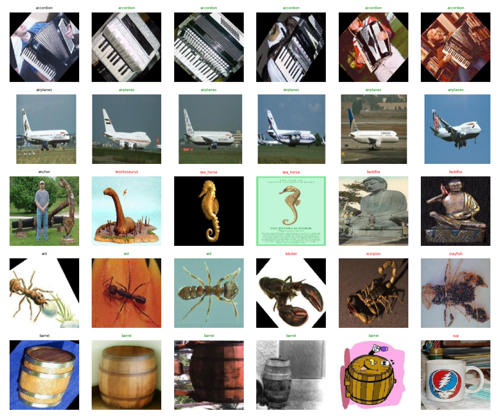
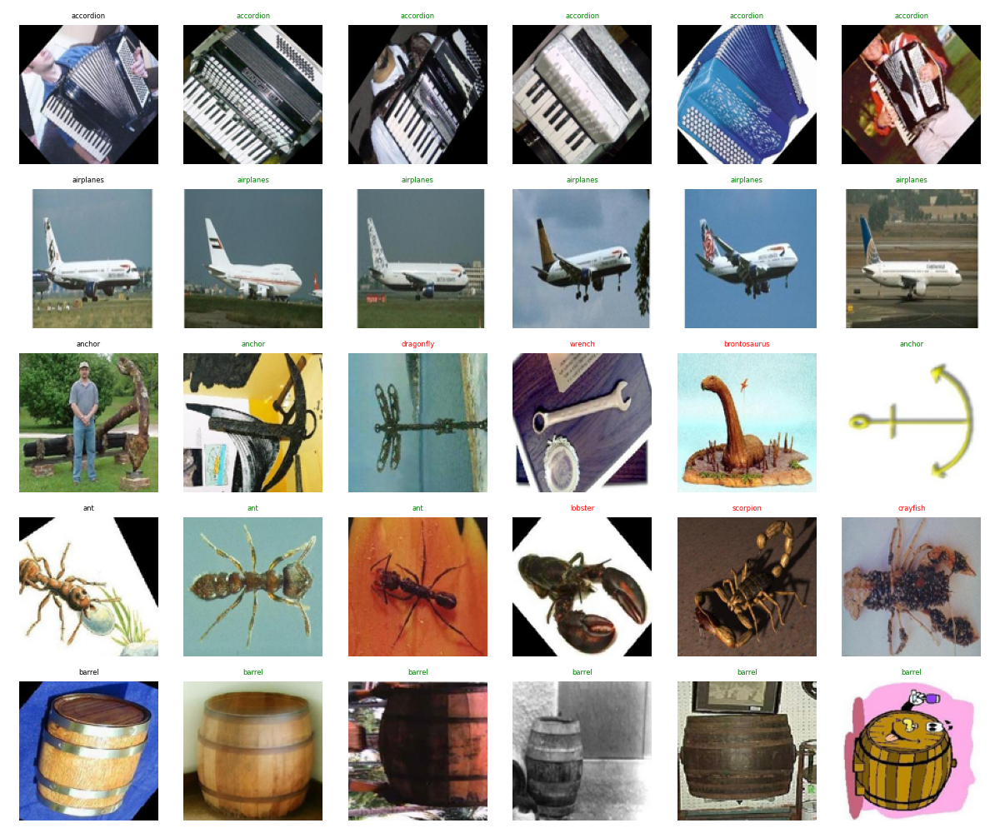

# Deep Metric Learning

This repository explores and compares different deep metric learning techniques, specifically Contrastive Loss, Triplet Loss, and Batch Hard Mining. 
---


## Model Architecture

The core backbone of the model utilizes a pre-trained **ResNet50**. 
* The final classification layer was removed.
* Two fully connected layers were added to project the features into a lower-dimensional embedding space:
  `512 -> ReLU -> 128`

---


## Dataset & Sampling Strategy

Images are first preprocessed using standard [PyTorch ResNet50 transforms/weights](https://docs.pytorch.org/vision/stable/models/generated/torchvision.models.resnet50.html#torchvision.models.ResNet50_Weights). To train the models effectively, different sampling strategies were used for each loss function:

* **Contrastive Sampling:** For each image, there is a 50% chance to sample a positive pair (same class) or a negative pair (different class).
* **Triplet Sampling:** Each image acts as an anchor once. It is randomly paired with one positive image (same class) and one negative image (from any other class).
* **Batch Hard Mining:** A custom batch sampler is used to ensure hard positives exist in the batch. The batch size is set to 64, strictly containing **8 classes with 8 images per class**. This guarantees enough samples per class to mine the hardest positives and negatives dynamically.
---
## Training Optimization

To address slow training times, the dataset was pre-processed by passing all images through the frozen ResNet50 backbone and caching the embeddings. 

**Result:** Training time dropped to approximately **1 second per epoch**, making the overall experimentation incredibly fast.

---

## Results & Performance

Batch Hard Mining significantly outperforms the other methods, particularly showing a large jump in Recall@1 compared to standard Triplet Loss.

| Model | Recall@1 | Recall@5 |
| :--- | :--- | :--- |
| **Contrastive** | 0.7517 | 0.8809 |
| **Triplet** | 0.7988 | 0.9181 |
| **Batch Hard Mining** | **0.8458** | **0.9425** |

---

## Visualizations

### t-SNE Embeddings

**Observations:**
* **Contrastive & Triplet:** A lot of classes are compressed together. Classes with fewer samples tend to merge into one another.
* **Hard Mining:** Noticeably better separation. Classes with fewer samples maintain a clear distance from others.Overall class boundaries are much more distinct.

| Contrastive | Triplet | Hard Mining |
| :---: | :---: | :---: |
| ** | ** | ** |


### Retrieval Visualizations

When evaluating 20-25 random queries, the top 5 retrieved images generally make visual sense. Even when the model returns an incorrect label, the retrieved image visually resembles the query. 

| Contrastive Retrieval | Triplet Retrieval | Hard Mining Retrieval |
| :---: | :---: | :---: |
|  |  |  |

---


## Setup
Place the dataset at `data/caltech-101/` and the ResNet-50 weights at `weights/resnet50.pt`.

### Precompute Features
Run once to cache backbone features for all splits:
```bash
python3 code/precompute.py
```

## Train
`--option 1` contrastive, `--option 2` triplet, `--option 3` hard mining.
```bash
python3 code/train.py --option 1 --epochs 30
```

## Test
Pass the path to a saved model weight:
```bash
python3 code/test.py --model_path weights/<run>/best_triplet.pt
```
Outputs Recall@1, Recall@5, t-SNE plot, and retrieval grid in the same folder.

## Inference
Run on a single image to get top-5 nearest classes:
```bash
python3 code/inference.py --model_path weights/<run>/best_triplet.pt --image_path data/caltech-101/accordion/image_0001.jpg
```


---
## Discussion & Further Experiments

* **Hybrid Training Approach:** An experiment was conducted where the model was trained with Triplet Loss (random sampling) for the first 10-15 epochs, and then transitioned to Batch Hard Mining for the remaining epochs. Interestingly, this hybrid model did not perform as well as pure Batch Hard Mining and ended up yielding results similar to the baseline Triplet model.
* **Why Hard Mining Wins:** In standard Triplet Loss, the probability of naturally getting 5+ images of the same class in a standard random batch of 32 or 64 is extremely low (given 102 total classes). Forcing the batch structure (8 classes × 8 samples) allows the network to learn from meaningful, difficult examples rather than saturating on easy negatives.


